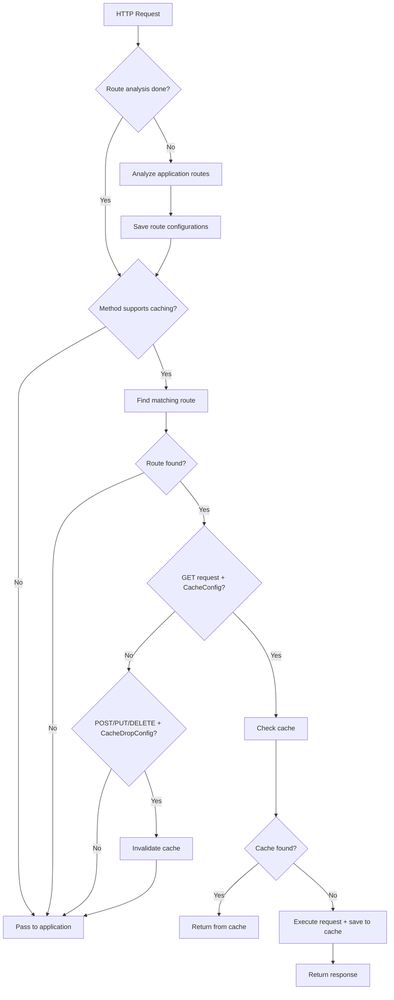

# 🏗️ Architecture

This section describes the internal architecture of **FastCacheMiddleware** and explains how its components interact during request processing.

---

### System Components

The middleware is organized into several core components, each responsible for a specific concern:

```
FastCacheMiddleware
├── RouteInfo           # Route information with cache configuration
├── Controller          # Caching logic and validation
├── Storage             # Storages (InMemory, Redis, etc.)
├── Serializers         # Cached data serialization
└── Dependencies        # FastAPI dependencies for configuration
```
- **RouteInfo** – keeps metadata about routes, such as cache settings, TTLs, and invalidation rules.  
- **Controller** – the core engine that decides whether to cache, return cached data, or invalidate.  
- **Storage** – abstraction over different cache backends (e.g., in-memory, Redis).  
- **Serializers** – responsible for efficient serialization and deserialization of cached responses.  
- **Dependencies** – FastAPI-compatible dependency classes (`CacheConfig`, `CacheDropConfig`) that allow you to configure caching behavior declaratively.  

This modular design ensures **flexibility**, **extensibility**, and clean separation of concerns.

---

### Request Processing Flow

The request lifecycle in **FastCacheMiddleware** follows a clearly defined flow:



Step-by-step explanation:

* Route analysis – On the first request, the middleware analyzes all routes and extracts cache-related dependencies.
* Method check – Only GET requests are eligible for caching; POST/PUT/DELETE may trigger cache invalidation.
* Cache lookup – If caching is enabled for the route, the middleware attempts to retrieve a response from the cache.
* Cache hit – If data is found, it is returned immediately, skipping application logic.
* Cache miss – If no cache entry exists, the request is executed normally, and the response is stored for future use.
* Cache invalidation – Mutating requests (POST/PUT/DELETE) with CacheDropConfig remove matching cache entries to keep data consistent.
* This flow ensures minimal latency for cached requests while guaranteeing correctness when the underlying data changes.